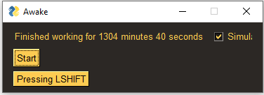

# AwakePy
## Script for very productive people

this python script keeps your screen awake whenever you need it.

 - Allows switching between two button presses, standard are shift and space
 - Allows switching between virutal (pyautogui) and physical button presses

 ## Requirements
 - Requires python 3.10
 - Pipenv would be good, but is not needed

 ## Installation
### Normal pip install
- Switch into the folder where the script is located and execute `pip install`
### Pipenv install
- If you have pipenv: `pipenv install`